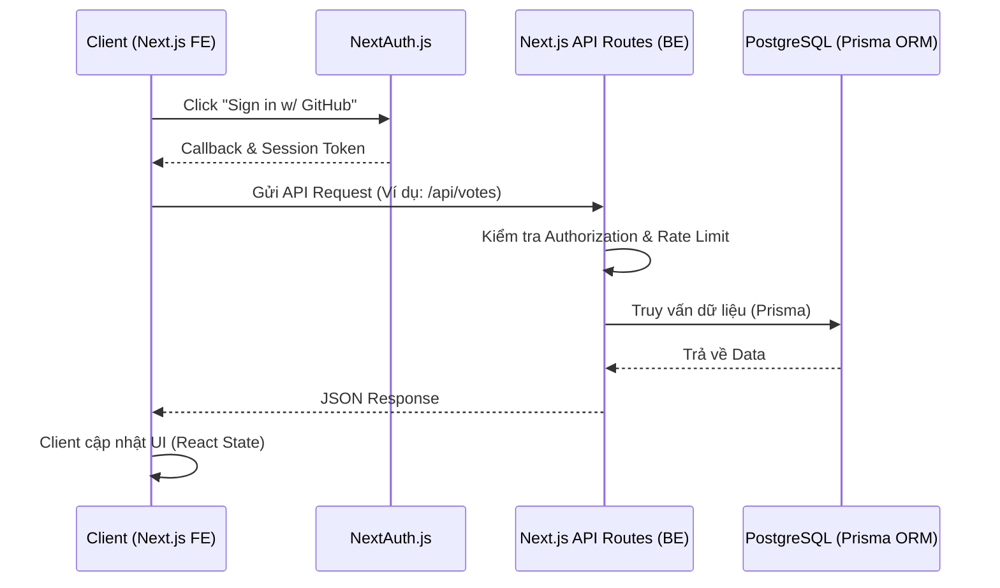

# Báo Cáo Hoàn Thành Bài test - Vị Trí Thực Tập Sinh CNTT (Dev Intern)
**Ứng viên:** Nguyễn Quỳnh Trang  
**Dự án:** Intern Community Hub (Nền tảng chia sẻ tiểu ứng dụng của cọng đồng Intern)

Kính gửi bộ phận Tuyển dụng và anh/chị Technical Reviewer,

Dưới đây là báo cáo chi tiết về quá trình em thực hiện bài Assessment. Nội dung được trình bày theo trình tự thời gian giải quyết sự cố, bắt đầu từ việc setup môi trường, fix các bug hạ tầng, hoàn thành các Issue cấp độ Medium và cuối cùng là chủ động nâng cấp UI/UX. Hệ thống báo cáo tuân thủ nguyên tắc: **Xác định nguyên nhân gốc (Root Cause) -> Đề xuất giải pháp -> Vị trí code điều chỉnh**.

---

## 🏛️ Sơ Đồ Hệ Thống & Tầm Nhìn Kiến Trúc
Trước khi đi vào chi tiết fix lỗi, em xin tóm tắt kiến trúc của hệ thống hiện tại và khả năng mở rộng.

**Mục đích hệ thống:** `Intern Community Hub` đóng vai trò là một sân chơi tập trung cho các thực tập sinh đóng góp, khám phá và vote cho các tiểu ứng dụng (Mini-app) mã nguồn mở.  
**Khả năng mở rộng (Future Scaling):** 
- *Caching:* Khi lượng truy cập lớn, có thể thêm Redis ở giữa Server và Database để cache danh sách API `/api/modules` tránh query DB liên tục.
- *Microservices:* Tách module Submit và Notification thành các service độc lập chạy background jobs.

---

## 🛠️ PHẦN 1: XỬ LÝ LỖI KHỞI TẠO MÔI TRƯỜNG & AUTHENTICATION

Trong quá trình khởi chạy dự án theo README, em liên tục gặp các rào cản về tương thích Node.js và NextAuth. Dưới sự hỗ trợ của AI để chẩn đoán log lỗi, em đã từng bước gỡ rối:

### 1. Sự cố Docker & Prisma Target (Lỗi lệnh `pnpm db:seed`)
* **Nguyên nhân:** Máy tính đang sử dụng Node.js v16.20.2 và v18.12, trong khi engine Prisma của dự án yêu cầu bộ thư viện runtime của Node.js v20+. Hệ quả là lệnh `pnpm db:seed` báo lỗi đỏ trên Terminal do không parse được Prisma Client.
* **Cách khắc phục:** 
  - Khai thác AI GPT để nhận diện nhanh xung đột phiên bản.
  - Xóa folder `node_modules`, nâng cấp lên **Node.js v20.20.2**.
  - Thiếu lập PostgreSQL qua Docker, cập nhật `.env` và chạy lại `pnpm prisma generate`. Kết quả cắm 10 modules mẫu thành công.

### 2. Sự Cố 404 Not Found Khi Đăng Nhập GitHub OAuth
* **Nguyên nhân:** Khung NextAuth v5 không tự động cung cấp UI mặc định cho `/api/auth/signin` nhưng code cũ lại trỏ Redirect về đó khi user chưa đăng nhập. Hơn nữa, `AUTH_GITHUB_ID` trong `.env` bị trống.
* **Vị trí sửa:** `src/app/page.tsx` và `src/app/auth/signin/page.tsx`.
* **Cách khắc phục:** 
  - Đăng ký app trên GitHub Developer settings, thêm client/secret vào `.env`.
  - Tự thiết kế một trang `/auth/signin` riêng bằng Client Component.
  - Đổi lại toàn bộ route redirect từ `/api/...` về `/auth/signin` giúp hệ thống điều hướng trơn tru.

### 3. Cánh Cáo Hydration Mismatch Do Cơ Chế SSR Của Next.js
* **Nguyên nhân:** Môi trường Server không có biến `window`, nhưng code cũ gọi `{window.location.origin}`. Đồng thời Component input và Navbar thay đổi State tức thì ở lần render đầu, gây xung đột mã HTML giữa Server và Client.
* **Cách khắc phục:** Đẩy các component liên quan sang file `"use client"` riêng biệt, dùng trick `[isMounted, setIsMounted] = useState(false)` gác lại việc render cho đến khi component mount xong ở Front-end.

---

## 🚀 PHẦN 2: THỰC THI MEDIUM ISSUES (TÍNH NĂNG CỐT LÕI)

### Tính năng 1: Lỗi Category Filter bị Load lại toàn trang (Full Page Reload)
* **Nguyên nhân:** Các pill Category được code thủ công bằng thẻ `<a href="/?category=gaming">`. Điều này vô tình triệt tiêu sức mạnh SPA (Single Page Application) của React, làm tải lại toàn bộ trang, đồng thời "xóa sổ" các tham số tìm kiếm đang có (như `?q=chat`).
* **Vị trí sửa:** Chuyển dời toàn bộ logic sang `src/components/category-filter.tsx`.
* **Cách khắc phục:**
  - Khởi tạo `URLSearchParams` từ `searchParams` hiện tại để bảo toàn key `q`.
  - Sử dụng `router.push('/?'+params)` từ thư viện `next/navigation` giúp cập nhật URL trên thanh địa chỉ mà hệ thống chỉ load đúng data mới, không giật màn hình (SPA merge).

### Tính năng 2: Chống Spam API bằng Rate Limits (`POST /api/votes`)
* **Nguyên nhân:** View Network tab cho thấy khi click vote liên tục, server đều nhẹ dạ trả về mảng `200 OK`. Nếu có bot spam, database bị DDoS.
* **Vị trí sửa:** `src/app/api/votes/route.ts`
* **Cách khắc phục:** 
  - Khởi tạo bộ đếm trong `globalThis` (để không bị mất state khi NextJS dev server hot-reload).
  - Áp dụng nguyên tắc: Giới hạn 10 lượt click / 60s cho mỗi IP/User. Các request tàn dư thứ 11 sẽ bị từ chối với status code `429 Too Many Requests` với thông báo `"You're voting too fast. Please wait 60 seconds."`

### Tính năng 3: Chuyển đổi Load More sang Offset-Pagination (Phân Trang)
* **Nguyên nhân:** Code gốc chỉ load cứng `take: 12` module, không có cách nào xem các mục cũ hơn.
* **Vị trí sửa:** `route.ts` (API API/Modules) & Thêm mới `paginated-modules.tsx`.
* **Cách khắc phục:**
  - Bổ sung data rác (seed data) với hàng tá module mới để quan sát cụ thể việc sang trang (3 items/page).
  - Xây mới Frontend component chứa cụm nút sang trang (`< 1 2 3 ... >`). Truyền tham số `page` và `limit` ngược lên API để nhận số liệu chuẩn xác tính ra `totalPages`.

### Tính năng 4: Nút Xóa (Delete) & Custom Popup Confirmation
* **Nguyên nhân:** Module sau khi "Submit" nằm chết ở trạng thái PENDING. Nhưng nếu lập trình viên muốn hủy submit, không có nút Delete nào cả. Khi có nút Delete, nếu dùng lệnh `window.confirm()` hiển thị thông báo thì quá nghiệp dư và phô kệch.
* **Vị trí sửa:** `src/components/delete-submission-button.tsx`.
* **Cách khắc phục:**
  - Em đã tự viết một thẻ Modal Pop-up riêng ở giữa màn hình bằng div che phủ (backdrop).
  - Modal được bao bọc bằng React ID state, gồm icon cái chuông báo, 1 nút OK (màu xanh Emerald) và 1 nút Cancel (màu Đỏ), mang lại cảm giác cực kỳ êm ái cho user. Xóa thành công, tự động gọi `router.refresh()` làm xịn danh sách.

---

## 🎨 PHẦN 3: NÂNG TẦM GIAO DIỆN (UI/UX REDESIGN)
Dù yêu cầu không bắt buộc, nhưng với tư duy product engineering, em đã đập đi xây lại hệ thống UI cho đẹp mắt.
* **Trắng bệch $\rightarrow$ Glassmorphism:** Đưa hiệu ứng thẻ kính mờ ảo (backdrop-blur) vào Navbar, Module Cards và Empty States.
* **Tương tác:** Nút Vote tam giác cũ kỹ được thay bằng Icon Hình bàn tay 👍, hiệu ứng bừng sáng, to lên 115% khi click xong. Header Homepage rực rỡ với banner gradient màu tím/indigo.

---

## 🤖 HIỆU SUẤT X2 KHI LÀM CHỦ CÔNG CỤ AI
Cách em đã tương tác với trí tuệ nhân tạo (AI GPT) không dừng lại ở việc copy code, mà để **Master Data Flow (Làm chủ luồng dữ liệu)**:
1. Em giao cho AI đọc các file log lỗi `stack-trace` khô khan của Next.js để tìm xem biến môi trường nào bị khuyết mà mình nhìn sót. 
2. Em chủ động định hướng cho AI: *"Tạo cho tao 1 pop up thông báo xác nhận xóa có chức năng chuông thay vì `window.confirm`"*. AI hỗ trợ generate ra template CSS thuần có hoạt ảnh (animation), còn em là người đặt lại vị trí State React cho khớp với luồng Submit của App.

Em tin rằng việc tư duy nhanh nhạy + kỹ năng điều khiển AI thông minh là tố chất sống còn của một kỹ sư IT hiện đại. Mong anh/chị xem xét qua Pull Request này của em!

Trân trọng,
Nguyễn Quỳnh Trang
